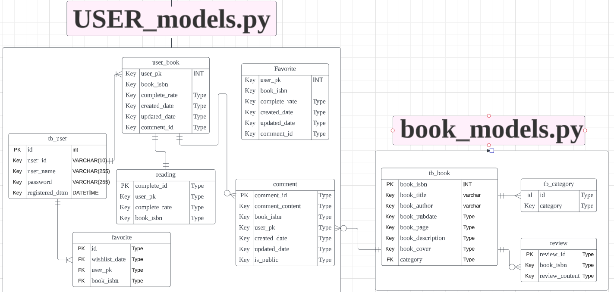

# 빅데이터 기반 도서추천 및 독서모임 관리 서비스 개발
- 수행기간 : 2023.06.19 ~ 2023.07.31
- 구성원 : 4명(데이터 수집, 전처리, 모델링 / 웹개발)
  
## 프로젝트 배경
실제 운영되는 독서모임 규모가 확대되면서 모임 운영에 있어서 도서 선정의 어려움 해결, 여러 도서 비교 기능과 모임 운영 시스템의 필요성 대두

## 주요 업무
- 도서의 세분화된 새로운 카테고리 생성을 위한 도서 정보 데이터 활용 토픽모델링
- 컨텐츠 기반 추천시스템을 사용한 도서 정보 활용 회원 맞춤 도서 추천 시스템 구현 
- 감성 분류기를 사용하여 리뷰 데이터 분석을 통한 추천된 도서에 대한 알라딘 독자의 평가를 예측  
- 독서모임 회원들이 로그인, 도서 추천, 도서 상세 정보 등의 기능을 사용할 수 있도록 웹 서비스 구현

## 데이터 파이프라인(ETL 구조)

## ERD 

## 데이터 출처
- 도서 정보 데이터 : 알라딘 OpenAPI
- 도서 리뷰 데이터 : 알라딘 web
> 저작권 문제로 해당 데이터는 업로드하지 않음

## 개발 환경
- Python
- Django

## 파일 설명

